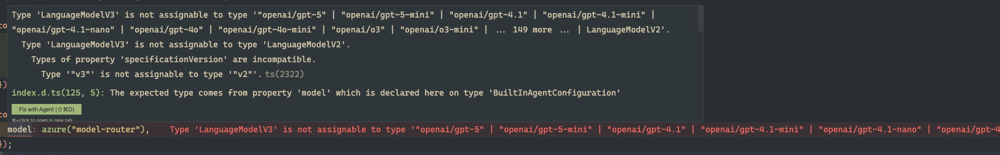

# CopilotKit + AI SDK v6 Incompatibility

CopilotKit (as of v1.51.4) is incompatible with AI SDK v6. The root cause is a breaking change in the AI SDK's language model specification:

| | AI SDK v5 | AI SDK v6 |
|---|---|---|
| Model type | `LanguageModelV2` | `LanguageModelV3` |
| `specificationVersion` | `"v2"` | `"v3"` |

CopilotKit's `BuiltInAgentConfiguration` declares its `model` property as `LanguageModelV2`. When using any AI SDK v6 provider (e.g. `@ai-sdk/azure@^3.x`, `@ai-sdk/openai@^3.x`), the returned model objects are `LanguageModelV3`, which TypeScript correctly rejects:

```
Type 'LanguageModelV3' is not assignable to type 'LanguageModelV2'.
  Types of property 'specificationVersion' are incompatible.
    Type '"v3"' is not assignable to type '"v2"'.
```

### Screenshot



### Why we can't downgrade

Our production codebase depends on AI SDK v6 features that don't exist in v5, including the tool loop agent, new provider tools, and the updated streaming APIs. Downgrading to AI SDK v5 is not viable.

### Reproduction

```bash
git clone <repo-url>
git checkout 11-copilot-built-in-agent-with-ai-sdk-v6
bun install
# Open src/app/api/copilotkit/route.ts — the type error is visible immediately
```
